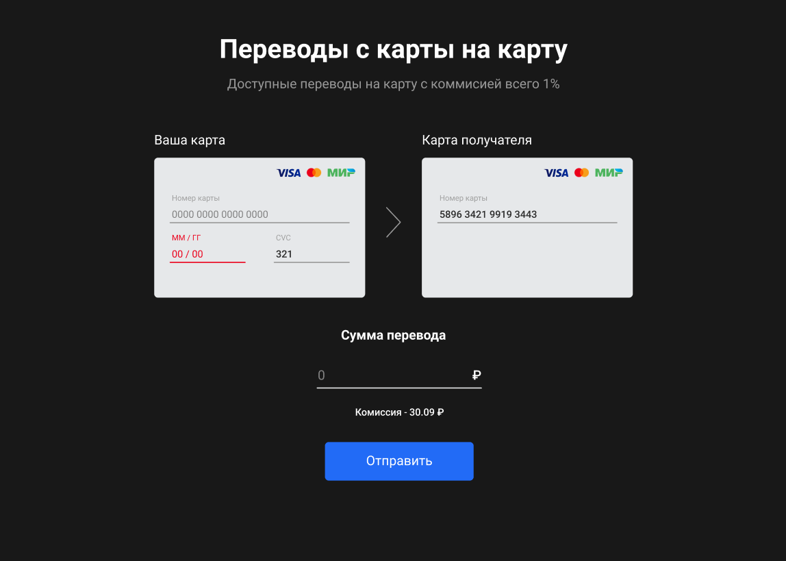
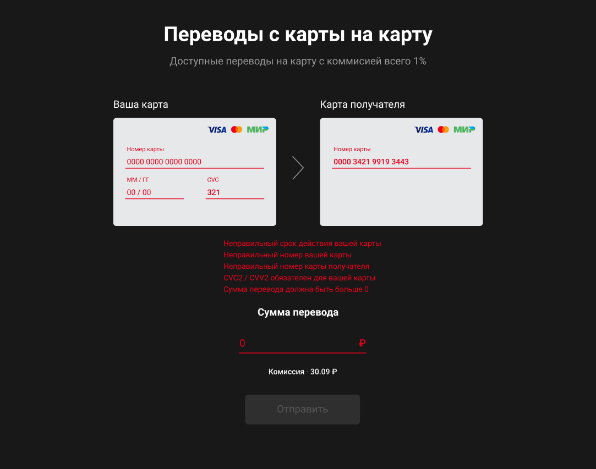
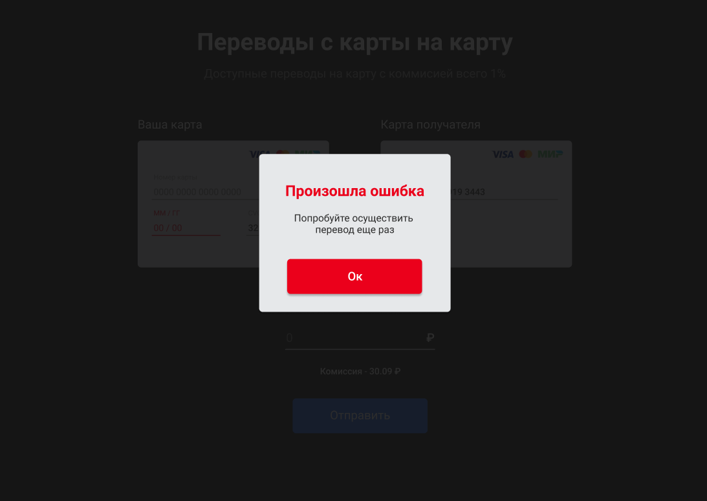

# Описание работы SpringBoot REST приложения "Сервис перевода денег" (MoneyTransferServiceApp) 

## Подготовка 
1. Клонировать проект из ссылки https://github.com/tsarkoff/netology-money-transfer-service.git
## Использование бэк-приложения из IDEA
2. Открыть проект в IDEA
3. Запустить приложение MoneyTransferServiceApp
4. Использовать запросы из файла src/main/java/resources/generated-requests.http
5. Результаты работы смотреть в консоли и/или в лог-файле moneyapp.log
6. Запустить тесты (**на базе Mockito**) из файла MoneyTransferServiceTest.java
## Использование бэк-приложения совместно с Докером
7. Собрать приложение с помощью "maven lifecycle = target package" (-DskipTests)
8. В корневом каталоге приложения выполнить команду "docker build -t moneyapp ."
9. Или в корневом каталоге приложения выполнить команду "docker-compose up"
10. Запустить тесты (**на базе Testcontainers**) из файла MoneyTransferServiceAppTest
11. Использовать запросы к контейнеру из файла src/main/java/resources/generated-requests.http
12. Убедиться в успешном выполнении тестов
3Результаты работы приложения / выполнения тестов смотеть в консоли
## Использование фронт-приложения из IDEA совместно с бэк-приложением (с запуском бэк-приложения из IDEA или в Докере) 
13. Запустить команду npm start (для предварительно собранного фронт-приложения, как указано в задании) - откроется браузер по умолчанию и отобразит страницу фронт-приложения перевода денег
5Запустить приложение MoneyTransferServiceApp в IDEA или в Докере, как описано в параграфах выше
14. Ввести на странице фронт приложения данные карт (источник, получатель), сумму и нажать кнопку "Перевести" (данные валидных карт можно посмотреть в файле src/main/java/repository/CardRepositoryImpl.java)
15. Результаты работы приложения / выполнения отобразятся на странице и/или смотеть в консоли / лог-файле
## Тестирование с помощью POSTMAN
16. Импортировать в Postman коллекцию из корневого каталога приложения postman_collection.json
17. Использовать POST запросы "transfer" и "confirmOperation"
18. Замечание: запросы из Postman работают с приложением, запущенным и из IDEA и/или в Докер-контейнере 
--------------------------------------------
НИЖЕ - ОРИГИНАЛ ТЕКСТА ИЗ ЗАДАНИЯ НА КУРСОВУЮ РАБОТУ
# Курсовой проект «Сервис перевода денег»

## Описание проекта

Необходимо разработать приложение — REST-сервис. Сервис должен предоставить интерфейс для перевода денег с одной карты на другую по заранее описанной спецификации.

Заранее подготовленное веб-приложение (FRONT) должно подключаться к разработанному сервису без доработок и использовать его функционал для перевода денег.

## Требования к приложению

- Сервис должен предоставлять REST-интерфейс для интеграции с FRONT.
- Сервис должен реализовывать все методы перевода с одной банковской карты на другую, описанные [в протоколе](https://github.com/netology-code/jd-homeworks/blob/master/diploma/MoneyTransferServiceSpecification.yaml).
- Все изменения должны записываться в файл — лог переводов в произвольном формате с указанием:
- даты;
- времени;
- карты, с которой было списание;
- карты зачисления;
- суммы;
- комиссии;
- результата операции, если был.

## Требования в реализации

- Приложение разработано с использованием Spring Boot.
- Использован сборщик пакетов gradle/maven.
- Для запуска используется Docker, Docker Compose .
- Код размещён на GitHub.
- Код покрыт юнит-тестами с использованием mockito.
- Добавлены интеграционные тесты с использованием testcontainers.

Шаги реализации:

1. Изучить протокол получения и отправки сообщений.
1. Нарисовать схему приложений.
1. Описать архитектуру приложения, где хранятся настройки, описать формат хранения данных о картах.
1. Создать репозиторий проекта на GitHub.
1. Протестировать приложение с помощью curl/postman.
1. Написать Dockerfile и создать контейнер.
1. Написать Docker Compose  скрипт для запуска FRONT и написанного REST-SERVICE.
1. Протестировать запуск с помощью Docker Compose и интеграцию с FRONT.
1. Написать README.md к проекту, где описать команду запуска, порт и примеры запросов.
1. Отправить на проверку.

## Описание интеграции с FRONT

FRONT доступен [по адресу](https://github.com/serp-ya/card-transfer). Можно скачать репозиторий и запустить Node.js приложение локально (в описании репозитория FRONT добавлена информация, как запустить) или использовать уже развёрнутое демо-приложение [по адресу](https://serp-ya.github.io/card-transfer/) (тогда ваш API должен быть запущен [по адресу](http://localhost:5500/)).
> Весь API FRONT был описан в соответствии [YAML](https://github.com/netology-code/jd-homeworks/blob/master/diploma/MoneyTransferServiceSpecification.yaml)
файла по спецификации OpenAPI (подробнее [по ссылке 1](https://swagger.io/specification/) и [ссылке 2](https://starkovden.github.io/introduction-openapi-and-swagger.html)).

При возникновении любых вопросов, пожалуйста, задавайте их преподавателю.

Успехов в разработке!

# Переводы с карту на карту

Приложение предоставляет простой интерфейс перевода денег с карты на карту.

Демо: https://serp-ya.github.io/card-transfer/

## Запуск
Для запуска приложения нужно склонировать репозиторий, открыть корневую директорию проекта и выполнить команду `npm i`. После установки всех зависимостей, нужно поменять значение переменной `REACT_APP_API_URL` в файле `.env` URL нашего API на свой. Описывать эндпоинты в файле `.env` **НЕ НУЖНО**.

Для запуска приложения необходимо выполнить команду `npm run start` в корневой папке проекта. Проект будет доступен по ссылке `http://localhost:3000/`.

## Описание
Проект предоставляет UI для перевода денег с карты на карту. В видимой части приложения присутствуют две карты (откуда и куда переводить), поле ввода суммы перевода и кнопка "отправить".

На форму наложены ограничения и форматирования ввода, можно ввести только числа.

Форматирование на полях:
Номер карты `0000000000000000` => `0000 0000 0000 0000`
ММ/ГГ `1234` => `12/34`
Сумма перевода `12345678` = `₽ 12 345 678`

Валидации на полях:
`Номер карты` - обязательное, минимум 16 знаков
`ММ/ГГ` - обязательное, минимум 4 знака, дата не может быть ниже текущей, месяц не может быть ниже 1 и выше 12
`CVC` - обязательное, минимум 3 знака
`Сумма перевода` - обязательное, не может быть равное или меньше 0

Проверка ошибок срабатывает во время нажатия кнопки "Отправить"

## Запросы
Запросы формируются самим приложением на URL состоящий из заданного значения переменной `REACT_APP_API_URL` и "хвостов" эндпоинта.

Эндпоинты:
`/transfer` - принимает объект с данными формы
`/confirmOperation` - принимает объект с айди операции и секретным кодом

При возникновении ошибки на стороне сервера, будет отображено модальное окно с текстом ошибки, которую сервер прислал в поле `message` ответа.

При успешной отправке, отображается соответствующее модальное окно и поля формы очищаются.

